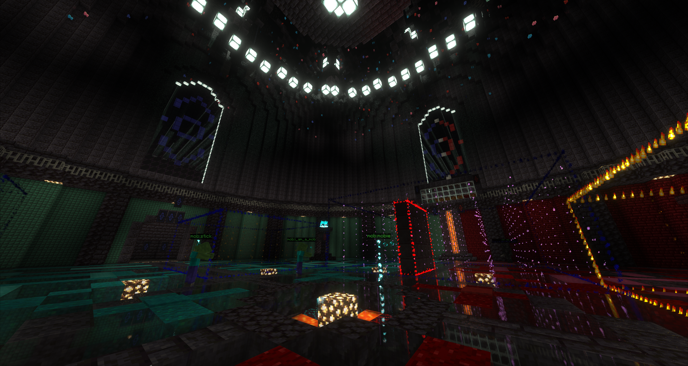

# Instantiated, the better dungeon solution for Minecraft

Instantiated is a plugin designed to enhance gameplay by allowing the creation and customization of dungeons.

Utilizing libraries like WorldEdit, Instantiated provides a robust and flexible platform for instantiating dungeons with custom features such as custom mob spawning, interactive doors, and an intuitive dungeon edit mode.

Mythic mobs is supported, with the mythic-mobs.yml config file. Just add the dungeon mob identifier from in game to the map, with the value being the mythic mob type.

## Dependencies

1. Paper
    
    Needed for their library loading at runtime for compatibility with other plugins that may make use of Kotlin in Minecraft plugin development.

2. FastAsynchronousWorldEdit
    
    Needed for fast, efficient, and reliable block changes. Think of all the block changes!

## Features
Instantiated boasts many features, but of course not everything can be done. If you have a request or suggestion, do that in the [discord](https://discord.gg/XggaTq7kjR)

1. Edit mode
        
    With edit mode, you can customize nearly every facet of a dungeon, while the server is running. Now, some things cannot be done for performance or reliability reasons. In these sparse cases, changes must be done through the dungeons.json file.

2. Supreme error handling
    
    I like to think that Instantiated has quite nice error handling, making use of StackFrames to deduce the cause of nearly any error. This includes data syntax in the dungeons.json. So don't worry about changing things in there as long as you are ready to read the error and fix it!

## Showcase

## Documentation

## Support
Support is provided in the [discord](https://discord.gg/XggaTq7kjR), specifically in the `#create-ticket` channel.

## Credits
##### Created and maintained by DevMunky
##### Thanks for the help Faceguy